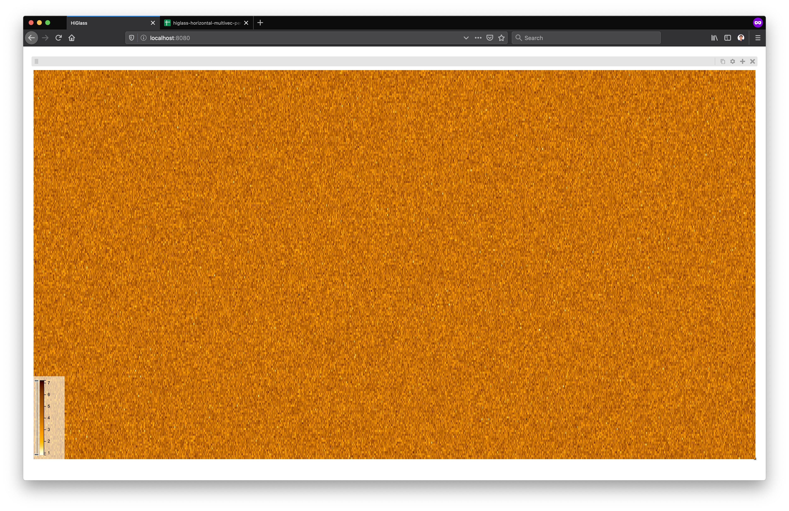
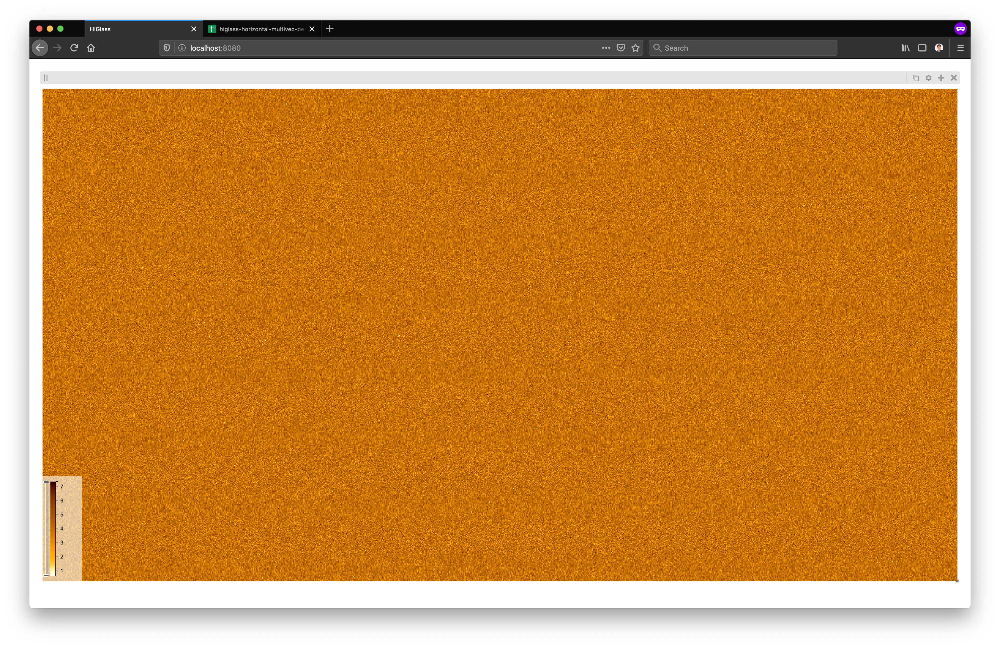
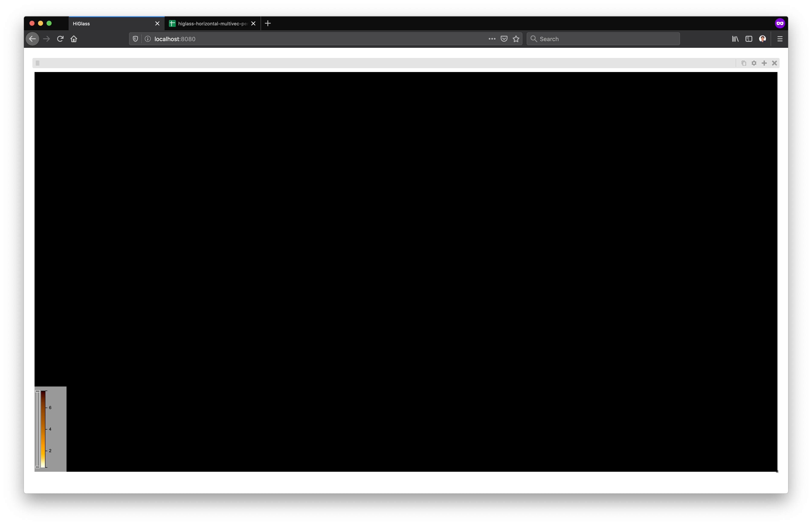
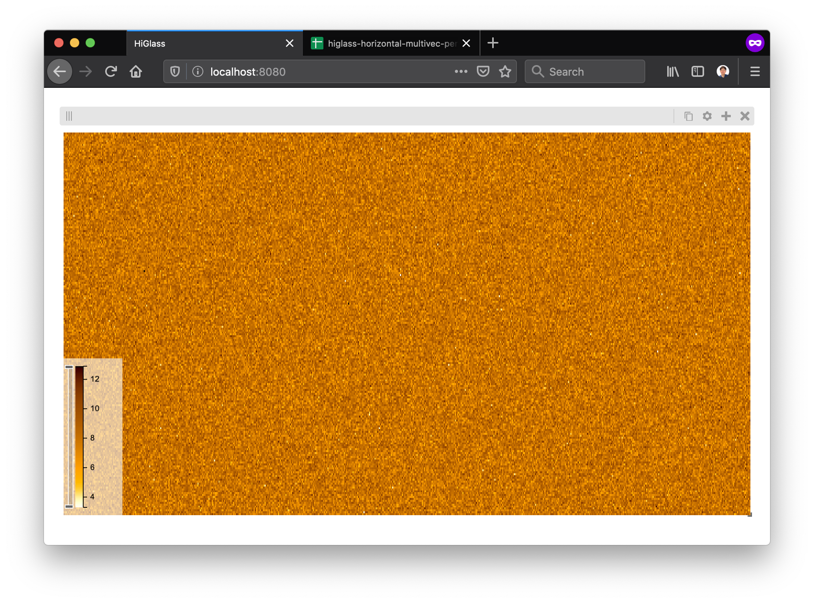
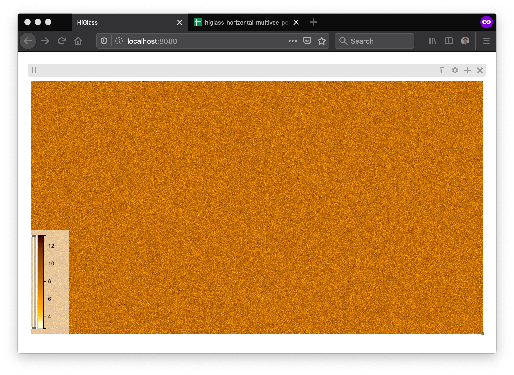
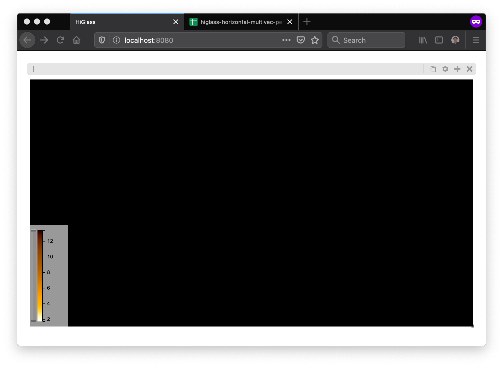

# Screen Setting

## View Size=1742x938, # Rows=200

## View Size=1742x938, # Rows=500

## View Size=1742x938, # Rows=1000

## View Size=1742x938, # Rows=5000

## View Size=1742x938, # Rows=50000

## View Size=875x488, # Rows=200

## View Size=875x488, # Rows=500

## View Size=875x488, # Rows=1000

## View Size=875x488, # Rows=5000

## View Size=875x488, # Rows=50000

